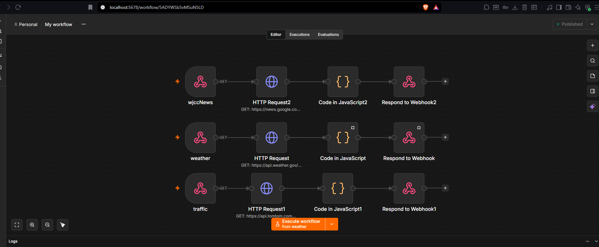
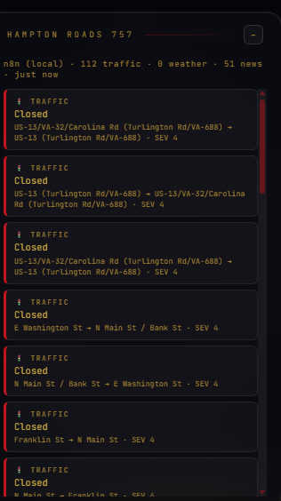
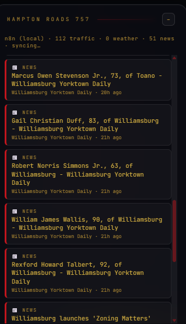
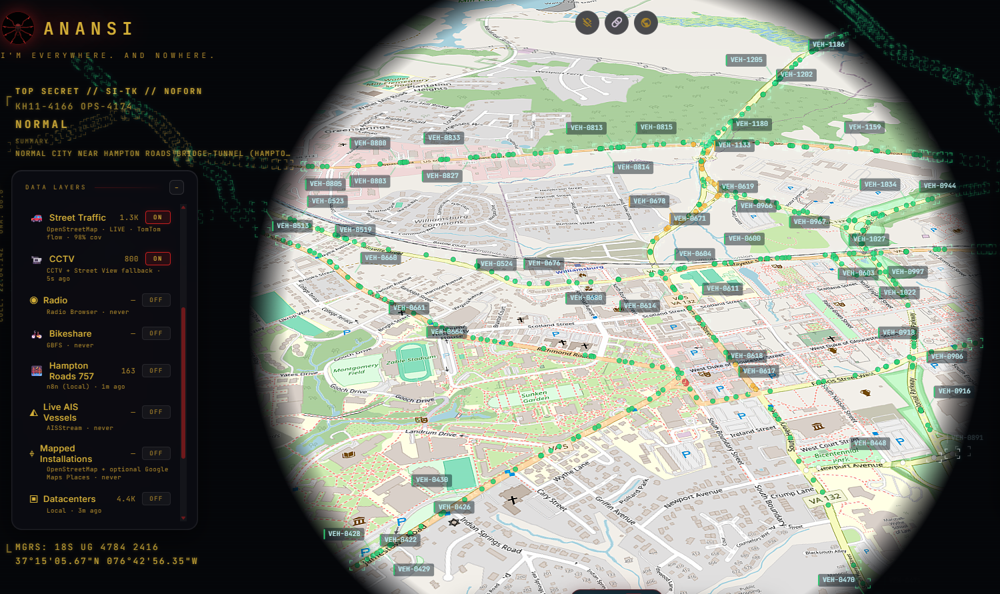

# Anansi — Real-Time Regional Intelligence Dashboard

# Overview

Anansi is a self-hosted, real-time geospatial dashboard for the Hampton Roads / Historic
Triangle region of Virginia (757 / 804 area codes). It combines a self-hosted **n8n**
automation server as the data ingestion and ETL layer with **God's Eye View**, an
open-source CesiumJS 3D globe visualization platform, to render live public data — traffic
incidents, weather alerts, and local news — as an interactive map layer.

The goal was to build something closer to a lightweight SOC-style situational awareness
tool than a static map: multiple independent data pipelines, normalized into a common
schema, polled on an interval, and rendered live without manual refresh.

| Component            | Description                                                |
| --------------------- | ------------------------------------------------------------ |
| Visualization Platform | CesiumJS-based 3D globe (God's Eye View, rebranded "Anansi") |
| Automation / ETL       | Self-hosted n8n, deployed via Docker                        |
| Traffic Data           | TomTom Traffic Incident + Flow APIs (v5), including live vehicle tracking |
| Weather Data           | NOAA / National Weather Service Alerts API                  |
| Local News             | Google News RSS, XML-parsed and geocoded by keyword match   |
| Custom Data Layer      | Hand-written CesiumJS module polling n8n webhooks           |
| Branding               | Custom UI theme, wordmark, and original spider-mark logo    |

---

# IMPLEMENTATION:

# [Environment Setup]

*The base platform is a Node.js/Vite application (God's Eye View), run locally on Windows
11. Setup involved installing Node 24.x, cloning the repository, and configuring a
`.env` file for API keys. A separate Docker Desktop installation (via Microsoft Store)
was required to self-host the automation layer — this required enabling virtualization
in the system BIOS, which was disabled by default.*

# [Self-Hosted Automation Server (n8n)]

*n8n was deployed as a Docker container (`docker.n8n.io/n8nio/n8n`), persisting workflow
data and credentials in a named Docker volume so state survives container restarts. This
serves as the ETL backbone: each data source gets its own workflow, triggered on-demand
by a webhook rather than a fixed schedule — meaning the pipeline only queries upstream
APIs when the dashboard is actually being viewed.*



# [Traffic Data Pipeline]

*A workflow pulls live incident data from TomTom's Traffic Incident Details API (v5)
scoped to a bounding box covering Norfolk, Virginia Beach, Chesapeake, Portsmouth,
Suffolk, Newport News, and Hampton. A Code node normalizes TomTom's GeoJSON response
(incident category, delay magnitude, affected roads) into a consistent
`{lat, lng, label, type, metadata}` schema shared across all data sources. Beyond
static incidents, the TomTom flow API also drives a live vehicle-tracking overlay —
individual moving vehicle markers rendered directly on real Williamsburg-area streets,
updating continuously rather than showing a fixed snapshot.*



# [Weather Alerts Pipeline]

*NOAA's public Alerts API (`api.weather.gov`) required no API key, but does require a
descriptive `User-Agent` header — omitting it results in a 403, a common but
under-documented gotcha with NOAA's API. Since NWS alerts are issued by administrative
zone rather than coordinate, a lookup table maps known Hampton Roads localities to
approximate coordinates so alerts can still be plotted geospatially.*

# [Local News Pipeline — Historic Triangle]

*The original plan used a Williamsburg-based news outlet's RSS feed directly, but the
source actively blocks automated requests at the network level (bot protection),
returning a 403 regardless of request headers. The workaround was switching to a
location-filtered Google News RSS query, which required writing a raw regex-based XML
parser in the Code node rather than relying on n8n's built-in XML-to-JSON conversion —
the actual parsed object shape didn't match documented conventions and needed to be
inspected directly from the HTTP response to get right. Obituary and real-estate
listing noise was filtered out at the parsing stage to keep the feed relevant to a
situational-awareness use case.*



# [Custom CesiumJS Data Layer]

*A dedicated JavaScript module polls all three n8n webhooks on a 45-second interval,
converts each normalized record into a Cesium point entity with a label, and renders
them as a single toggleable map layer. Malformed or missing-coordinate records are
skipped defensively rather than crashing the render loop. This was the piece of actual
application code added to the open-source base platform, wiring an external live data
pipeline into an existing 3D visualization engine.*

# [Rebrand: Anansi]

*The base platform was rebranded end-to-end — application name, color theme (black
background, red accents, gold text/headers), and a fully original spider-mark logo
designed for the project (inspired by the Anansi trickster-spider folklore figure, not
any copyrighted character). The rebrand touched the app title, header, favicon, and
theme variables throughout the codebase.*



---

# Architecture

```
n8n workflows (Docker, self-hosted)
  ├── Traffic  → TomTom API        ─┐
  ├── Weather  → NOAA Alerts API    ├─→ normalized JSON via webhook
  └── News     → Google News RSS   ─┘
                                        │
                                        ▼
                        Custom Cesium data layer (polls every 45s)
                                        │
                                        ▼
                         Anansi (CesiumJS 3D globe, in-browser)
```

Each n8n workflow is triggered by an incoming webhook request rather than a cron
schedule — the automation layer only calls upstream APIs when the dashboard itself
requests fresh data, which keeps API usage proportional to actual viewing time.

---

# Challenges & Troubleshooting

- **NOAA's undocumented User-Agent requirement** — a silent 403 with no indication of
  the cause until cross-referencing NOAA's own API documentation.
- **Source-level bot blocking** — the original news source's Cloudflare-style protection
  couldn't be bypassed with header spoofing, requiring a full pivot to a different feed.
- **n8n's XML node output shape** — didn't match assumed conventions three separate
  times; resolved by dumping the raw HTTP response and parsing the actual string
  structure directly rather than relying on the intermediate conversion node.
- **n8n's empty-array execution behavior** — a workflow returning zero results (a
  perfectly valid state, e.g. "no active weather alerts") silently halted the execution
  chain before reaching the response node, requiring the `Always Output Data` node
  setting to be explicitly enabled.
- **Google Cloud billing** — Google's Photorealistic 3D Tiles API requires a linked
  payment method even within free-tier usage; this blocked enabling the optional
  Google 3D imagery layer and remains a known limitation (see Future Work).

---

# Future Work

- Enable the Google Photorealistic 3D Tiles imagery layer once billing is configured.
- Persist historical snapshots of each layer (SQLite/Postgres) to support basic
  before/after trend queries instead of only showing current state.
- Add a lightweight alerting hook (Discord/Telegram webhook) for high-severity weather
  or traffic events.

---

# Skills Demonstrated

- **Automation / ETL engineering** — self-hosted n8n workflows normalizing three
  independent, differently-shaped public APIs into one consistent schema.
- **API integration & troubleshooting** — diagnosing auth/header requirements, bot
  protection, and inconsistent response shapes across multiple third-party services.
- **Full-stack extension of an existing platform** — writing and wiring new application
  code (a custom CesiumJS data layer) into an open-source base project.
- **Self-hosted infrastructure** — Docker-based deployment, container persistence, and
  local network configuration on Windows.
- **Product/UI work** — end-to-end rebrand including original logo design, color theming,
  and consistent naming across a codebase.

# Credit

This project is built directly on top of **[God's Eye View](https://github.com/bilawalsidhu/gods-eye-view)**,
an open-source CesiumJS geospatial visualization platform created by
**[Bilawal Sidhu](https://github.com/bilawalsidhu)**. His original demo/walkthrough of
the platform is available [on YouTube](https://youtu.be/0p8o7AeHDzg). Anansi extends that base platform
with a self-hosted n8n data pipeline, a custom regional data layer, and a full visual
rebrand — but the underlying 3D globe engine, layer architecture, and original concept
are his work. Full credit for the foundation this project builds on.

# Conclusion

Anansi demonstrates the ability to take a public, general-purpose open-source
visualization platform and turn it into a purpose-built, live regional intelligence
tool — designing the ETL pipeline, debugging real API and infrastructure issues as they
came up, extending the application's actual codebase with new functionality, and
finishing with a fully custom brand identity. The result is a working, self-hosted,
real-time dashboard built entirely on free-tier public data sources.
